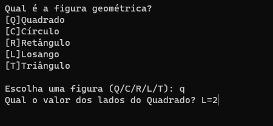
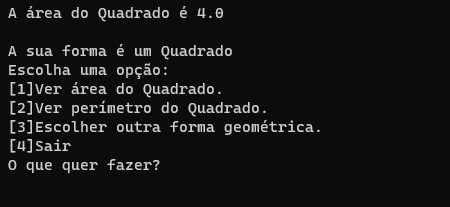

# Figuras Geometricas

O programa pergunta de qual figura geométrica o usuário quer as informações,
depois pergunta os valores e retorna a área, perímetro e tipo de triângulo (se o usuário escolher triângulo).

## Tela Inicial

## Exemplo de Área

